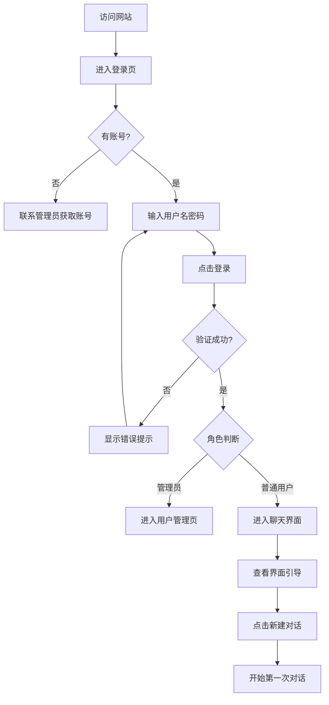
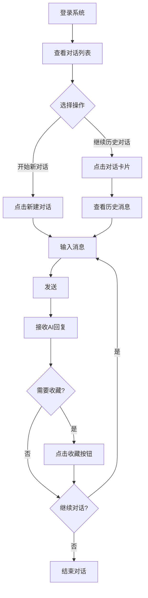
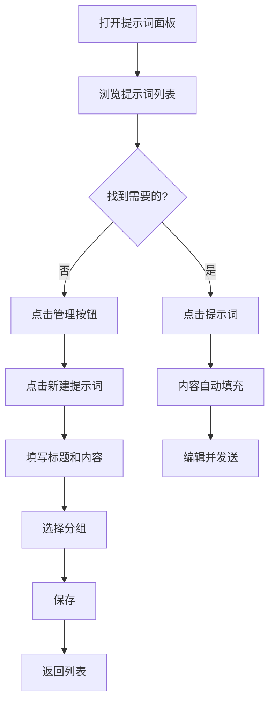
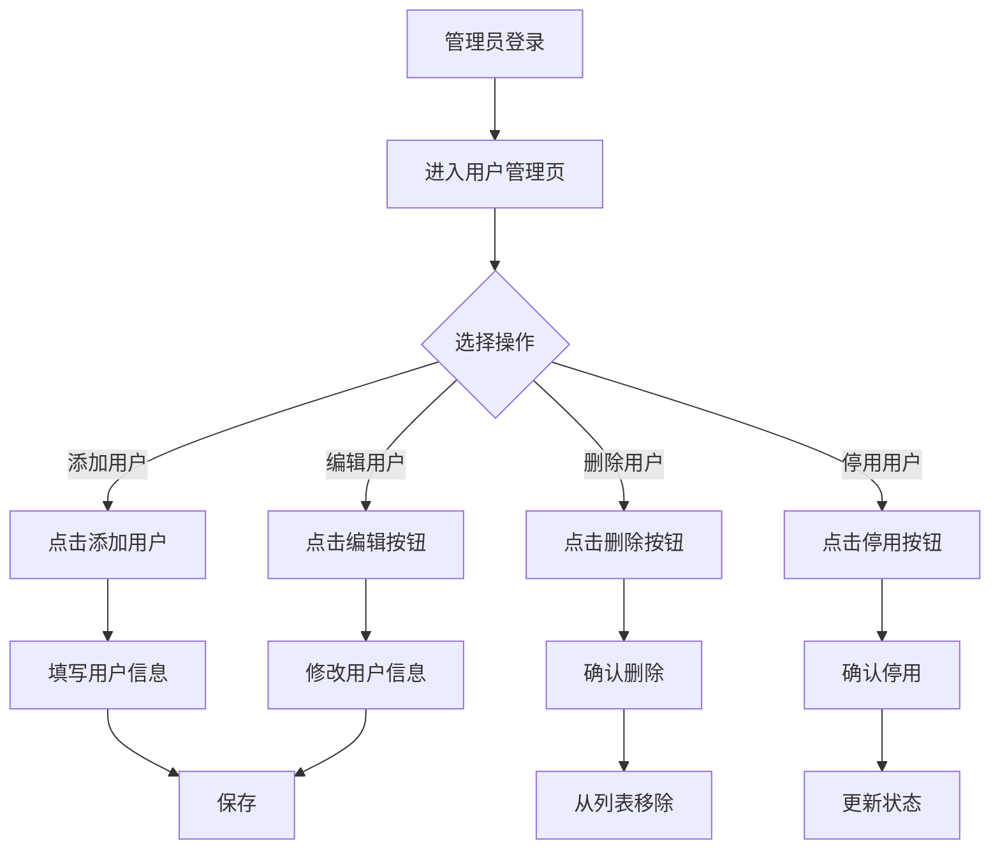

# AI 聊天助手 Web 应用 - 产品需求文档 (PRD)

**文档版本**: v1.0  
**创建日期**: 2026-02-17  
**产品经理**: [姓名]  
**最后更新**: 2026-02-17  

---

## 📋 目录

1. [产品概述](#产品概述)
2. [目标用户](#目标用户)
3. [核心价值](#核心价值)
4. [功能需求](#功能需求)
5. [设计规范](#设计规范)
6. [用户流程](#用户流程)
7. [技术要求](#技术要求)
8. [优先级与里程碑](#优先级与里程碑)
9. [成功指标](#成功指标)
10. [风险与挑战](#风险与挑战)
11. [未来规划](#未来规划)

---

## 1. 产品概述

### 1.1 产品定位
AI 聊天助手是一款面向企业和个人用户的智能对话平台，提供高效、智能的 AI 对话服务，帮助用户提升工作效率，解决各类问题。

### 1.2 产品愿景
打造最易用、最智能、最高效的 AI 对话助手，成为用户日常工作和学习的得力助手。

### 1.3 核心功能
- 💬 智能多轮对话
- 📝 提示词管理系统
- 👤 用户权限管理
- ⭐ 消息收藏与管理
- 🎨 个性化设置
- 📊 对话历史记录

---

## 2. 目标用户

### 2.1 用户画像

#### 主要用户群体
- **企业员工**: 需要使用 AI 辅助日常工作（代码审查、文案撰写、数据分析等）
- **学生群体**: 使用 AI 进行学习辅导、知识问答
- **内容创作者**: 利用 AI 进行创意灵感、内容生成
- **研发人员**: 使用 AI 辅助编程、调试、学习新技术

#### 管理员用户
- **系统管理员**: 负责用户管理、系统配置、权限分配

### 2.2 用户需求
| 用户类型 | 核心需求 | 痛点 |
|---------|---------|------|
| 普通用户 | 快速获得 AI 回答、保存常用提示词 | 重复输入相同问题、无法管理历史对话 |
| 管理员 | 管理用户账号、查看系统使用情况 | 缺乏统一的用户管理界面 |
| 企业用户 | 团队协作、知识沉淀 | 个人知识无法共享、缺乏协作机制 |

---

## 3. 核心价值

### 3.1 用户价值
- ⚡ **提升效率**: 通过 AI 快速获得答案，节省时间
- 🎯 **精准回答**: 使用提示词模板，获得更精准的回答
- 📚 **知识管理**: 收藏重要对话，建立个人知识库
- 🔄 **持续优化**: 通过历史对话不断优化使用体验

### 3.2 商业价值
- 💰 **降本增效**: 减少人工咨询成本
- 📈 **数据沉淀**: 积累用户对话数据，优化 AI 模型
- 🎓 **用户粘性**: 提示词管理和收藏功能增强用户粘性
- 🌐 **扩展性**: 易于集成到企业现有系统

---

## 4. 功能需求

### 4.1 用户认证系统

#### 4.1.1 登录功能
**优先级**: P0（必须有）

**功能描述**:
- 用户通过用户名和密码登录系统
- 支持"记住我"功能，7天免登录
- 登录失败提示用户名或密码错误

**测试账号**:
| 用户名 | 密码 | 角色 | 进入界面 |
|--------|------|------|---------|
| admin | admin123 | 管理员 | 用户管理页面 |
| user | user123 | 普通用户 | 聊天界面 |
| zhangsan | 123456 | 普通用户 | 聊天界面 |

**验收标准**:
- ✅ 输入正确账号密码可以成功登录
- ✅ 输入错误账号密码显示错误提示
- ✅ 勾选"记住我"后关闭浏览器再打开仍保持登录状态
- ✅ 管理员和普通用户进入不同界面

#### 4.1.2 退出登录
**优先级**: P0

**功能描述**:
- 用户可以随时退出登录
- 退出后清除登录状态
- 返回登录页面

---

### 4.2 对话管理系统

#### 4.2.1 新建对话
**优先级**: P0

**功能描述**:
- 点击"新建对话"按钮创建新对话
- 默认标题为"新对话"
- 自动置顶显示在对话列表
- 时间显示为"刚刚"

**验收标准**:
- ✅ 点击按钮成功创建对话
- ✅ 新对话出现在列表顶部
- ✅ 可以立即开始聊天

#### 4.2.2 对话列表
**优先级**: P0

**功能描述**:
- 左侧边栏显示所有历史对话
- 显示对话标题、时间
- 支持滚动浏览
- 点击对话可切换到该对话

**交互细节**:
- 鼠标悬停时显示操作按钮（编辑/下载/删除）
- 未悬停时显示时间信息
- 对话卡片带蓝色方块图标

**验收标准**:
- ✅ 所有对话按时间倒序排列
- ✅ 悬停时正确显示操作按钮
- ✅ 点击对话可以切换

#### 4.2.3 编辑对话标题
**优先级**: P1

**功能描述**:
- 悬停对话时点击编辑图标
- 弹出编辑对话框
- 修改标题并保存

**交互细节**:
- 弹窗居中显示
- 输入框自动聚焦
- 支持 Enter 保存、Esc 取消
- 不允许空标题

**验收标准**:
- ✅ 点击编辑图标弹出编辑框
- ✅ 修改并保存后标题更新
- ✅ 空标题无法保存
- ✅ 快捷键正常工作

#### 4.2.4 删除对话
**优先级**: P1

**功能描述**:
- 悬停对话时点击删除图标
- 弹出确认提示
- 确认后删除对话

**验收标准**:
- ✅ 点击删除弹出确认框
- ✅ 确认后对话从列表消失
- ✅ 取消后对话保留

#### 4.2.5 下载对话
**优先级**: P2

**功能描述**:
- 悬停对话时点击下载图标
- 导出对话内容为文本文件

**验收标准**:
- ✅ 点击下载按钮触发下载
- ✅ 文件格式为 .txt 或 .md
- ✅ 包含完整对话内容

#### 4.2.6 折叠/展开侧边栏
**优先级**: P1

**功能描述**:
- 点击折叠按钮收起侧边栏
- 折叠后显示展开按钮
- 展开后恢复完整侧边栏

**验收标准**:
- ✅ 折叠后宽度变为 48px
- ✅ 展开后宽度恢复 300px
- ✅ 动画流畅自然

---

### 4.3 聊天对话功能

#### 4.3.1 发送消息
**优先级**: P0

**功能描述**:
- 在输入框输入消息
- 点击发送按钮或按 Enter 发送
- 支持多行文本输入
- Shift + Enter 换行

**验收标准**:
- ✅ Enter 发送消息
- ✅ Shift + Enter 换行
- ✅ 消息正确显示在对话区
- ✅ 发送后输入框清空

#### 4.3.2 接收 AI 回复
**优先级**: P0

**功能描述**:
- AI 回复以气泡形式显示
- 支持打字机效果（可选）
- 显示 AI 头像

**验收标准**:
- ✅ AI 回复正确显示
- ✅ 气泡样式符合设计规范
- ✅ 与用户消息视觉区分明显

#### 4.3.3 消息操作
**优先级**: P1

**功能描述**:
- 悬停消息时显示操作按钮
- 支持操作：复制、朗读、收藏、删除

**交互细节**:
- 复制：一键复制消息文本
- 朗读：语音朗读消息内容
- 收藏：添加到个人收藏
- 删除：从对话中删除消息

**验收标准**:
- ✅ 悬停时显示操作按钮
- ✅ 复制功能正常
- ✅ 收藏后在个人中心可见
- ✅ 删除后消息消失

#### 4.3.4 消息格式支持
**优先级**: P2

**功能描述**:
- 支持 Markdown 格式
- 支持代码高亮
- 支持表格、列表等

**验收标准**:
- ✅ Markdown 正确渲染
- ✅ 代码块有语法高亮
- ✅ 表格和列表正确显示

---

### 4.4 提示词管理系统

#### 4.4.1 提示词列表
**优先级**: P1

**功能描述**:
- 右侧小浮窗点击打开提示词面板
- 显示所有提示词
- 支持按分组筛选
- 支持搜索

**验收标准**:
- ✅ 点击图标打开面板
- ✅ 提示词正确分组显示
- ✅ 搜索功能正常

#### 4.4.2 新建提示词
**优先级**: P1

**功能描述**:
- 点击管理按钮进入管理界面
- 点击新建按钮打开编辑器
- 填写标题、内容、选择分组
- 支持创建新分组

**交互细节**:
- 标题和内容为必填项
- 字符计数显示
- 新建分组验证重复
- 显示使用提示

**验收标准**:
- ✅ 表单验证正常
- ✅ 保存后提示词出现在列表
- ✅ 新分组创建成功

#### 4.4.3 编辑提示词
**优先级**: P1

**功能描述**:
- 悬停提示词卡片显示编辑按钮
- 点击打开编辑对话框
- 修改标题、内容、分组
- 保存更新

**验收标准**:
- ✅ 编辑框预填充现有内容
- ✅ 修改后正确更新
- ✅ 验证规则与新建相同

#### 4.4.4 删除提示词
**优先级**: P1

**功能描述**:
- 悬停提示词卡片显示删除按钮
- 点击直接删除（可选：添加确认）

**验收标准**:
- ✅ 删除后从列表移除
- ✅ 删除操作不影响其他提示词

#### 4.4.5 使用提示词
**优先级**: P1

**功能描述**:
- 点击提示词卡片
- 自动填充到输入框
- 用户可继续编辑后发送

**验收标准**:
- ✅ 点击后内容填充到输入框
- ✅ 可以继续编辑
- ✅ 正常发送消息

#### 4.4.6 收藏提示词
**优先级**: P2

**功能描述**:
- 标记常用提示词为收藏
- 收藏的提示词在管理界面置顶
- 个人中心不显示收藏提示词（仅收藏消息）

**验收标准**:
- ✅ 收藏状态正确切换
- ✅ 收藏后在管理界面置顶

#### 4.4.7 提示词分组管理
**优先级**: P1

**功能描述**:
- 创建新分组
- 删除分组（提示词移动到默认分组）
- 重命名分组（可选）

**默认分组**:
- 全部
- 工作
- 学习
- 生活

**验收标准**:
- ✅ 创建分组成功
- ✅ 删除分组后提示词不丢失
- ✅ 分组筛选正常工作

---

### 4.5 用户管理系统（管理员）

#### 4.5.1 用户列表
**优先级**: P0

**功能描述**:
- 表格形式显示所有用户
- 显示字段：用户名、邮箱、角色、状态、注册时间、操作
- 支持分页（每页10条）

**验收标准**:
- ✅ 用户数据正确显示
- ✅ 分页功能正常
- ✅ 数据格式正确

#### 4.5.2 搜索用户
**优先级**: P1

**功能描述**:
- 支持按用户名、邮箱搜索
- 实时过滤结果

**验收标准**:
- ✅ 搜索结果正确
- ✅ 清空搜索恢复全部列表

#### 4.5.3 添加用户
**优先级**: P1

**功能描述**:
- 点击添加按钮打开表单
- 填写用户名、邮箱、密码、角色
- 验证邮箱格式、用户名唯一性
- 保存后添加到列表

**验收标准**:
- ✅ 表单验证正常
- ✅ 重复用户名提示错误
- ✅ 添加后立即显示在列表

#### 4.5.4 编辑用户
**优先级**: P1

**功能描述**:
- 点击编辑按钮打开表单
- 修改用户信息
- 保存更新

**验收标准**:
- ✅ 预填充现有数据
- ✅ 修改后正确更新
- ✅ 验证规则与添加相同

#### 4.5.5 删除用户
**优先级**: P1

**功能描述**:
- 点击删除按钮
- 弹出确认提示
- 确认后删除用户

**验收标准**:
- ✅ 确认框正确弹出
- ✅ 删除后从列表移除
- ✅ 不能删除当前登录用户

#### 4.5.6 停用/启用用户
**优先级**: P1

**功能描述**:
- 切换用户状态
- 停用后用户无法登录
- 启用后恢复登录权限

**验收标准**:
- ✅ 状态切换正常
- ✅ 停用用户无法登录
- ✅ 启用后可以登录

#### 4.5.7 用户统计
**优先级**: P2

**功能描述**:
- 显示总用户数
- 显示活跃用户数
- 显示管理员数量
- 显示普通用户数量

**验收标准**:
- ✅ 统计数字正确
- ✅ 实时更新

---

### 4.6 个人中心

#### 4.6.1 个人信息展示
**优先级**: P1

**功能描述**:
- 显示用户头像
- 显示用户名、邮箱、注册时间
- 显示统计信息

**统计信息**:
- 收藏消息数量
- AI 回复数量

**验收标准**:
- ✅ 信息正确显示
- ✅ 统计数字准确

#### 4.6.2 收藏消息管理
**优先级**: P1

**功能描述**:
- 显示所有收藏的消息
- 区分用户消息和 AI 回复
- 支持操作：复制、移除收藏
- 显示收藏时间

**交互细节**:
- 消息卡片带类型标签（AI/我）
- 悬停显示操作按钮
- 空状态提示引导用户添加收藏

**验收标准**:
- ✅ 收藏消息正确显示
- ✅ 复制功能正常
- ✅ 移除收藏后消失
- ✅ 空状态显示正常

#### 4.6.3 编辑个人信息
**优先级**: P2

**功能描述**:
- 修改头像
- 修改昵称
- 修改邮箱

**验收标准**:
- ✅ 修改后保存成功
- ✅ 信息实时更新

---

### 4.7 设置中心

#### 4.7.1 账户设置
**优先级**: P1

**功能描述**:
- 修改密码
- 绑定邮箱
- 账号安全设置

**验收标准**:
- ✅ 修改密码需要验证旧密码
- ✅ 邮箱验证正常

#### 4.7.2 通知设置
**优先级**: P2

**功能描述**:
- 系统通知开关
- 邮件通知开关
- 声音提示开关

**验收标准**:
- ✅ 开关状态保存
- ✅ 设置立即生效

#### 4.7.3 外观设置
**优先级**: P2

**功能描述**:
- 主题切换（浅色/深色/自动）
- 字体大小调整
- 消息密度（紧凑/舒适/宽松）

**验收标准**:
- ✅ 设置立即生效
- ✅ 刷新后保持设置

#### 4.7.4 隐私与安全
**优先级**: P2

**功能描述**:
- 清除对话历史
- 清除缓存数据
- 数据导出
- 账号注销

**验收标准**:
- ✅ 清除操作有确认提示
- ✅ 数据导出成功
- ✅ 注销账号不可恢复

---

### 4.8 问答系统

#### 4.8.1 常见问题列表
**优先级**: P2

**功能描述**:
- 显示常见问题及答案
- 支持折叠/展开
- 支持搜索

**默认问题**:
- 如何开始使用 AI 助手？
- 支持哪些功能？
- 如何保存对话记录？

**验收标准**:
- ✅ 问题列表正确显示
- ✅ 折叠/展开动画流畅
- ✅ 搜索功能正常

---

## 5. 设计规范

### 5.1 颜色系统

#### 主色调
```css
/* 经典蓝色 - 主要交互色 */
--primary-blue: #007AFF;
--primary-blue-hover: #0066DD;

/* 背景色 */
--background-main: #F5F7FB;      /* 全局背景 */
--background-white: #FFFFFF;     /* 卡片/面板背景 */

/* 消息气泡色 */
--message-user: #007AFF;         /* 用户消息 */
--message-ai: #E9E9EB;           /* AI 消息 */

/* 强调色 */
--accent-red: #FF6B6B;           /* 新建按钮 */
--accent-red-bg: #FFF5F0;        /* 新建按钮背景 */

/* 文字颜色 */
--text-primary: #1C1C1E;         /* 主要文字 */
--text-secondary: #8E8E93;       /* 次要文字 */
--text-tertiary: #C7C7CC;        /* 辅助文字 */

/* 边框颜色 */
--border-gray: #E5E5EA;
```

#### 语义色
```css
/* 成功 */
--success: #34C759;
--success-bg: #E8F5E9;

/* 警告 */
--warning: #FF9500;
--warning-bg: #FFF3E0;

/* 错误 */
--error: #FF3B30;
--error-bg: #FFEBEE;

/* 信息 */
--info: #5AC8FA;
--info-bg: #E3F2FD;
```

### 5.2 布局规范

#### 尺寸定义
```css
/* 顶部导航栏 */
--header-height: 70px;

/* 侧边栏 */
--sidebar-width: 300px;
--sidebar-collapsed-width: 48px;

/* 圆角 */
--border-radius: 10px;

/* 间距 */
--spacing-xs: 4px;
--spacing-sm: 8px;
--spacing-md: 12px;
--spacing-lg: 16px;
--spacing-xl: 24px;

/* 阴影 */
--shadow-sm: 0 1px 3px rgba(0, 0, 0, 0.05);
--shadow-md: 0 4px 12px rgba(0, 0, 0, 0.1);
--shadow-lg: 0 10px 30px rgba(0, 0, 0, 0.15);
```

### 5.3 组件规范

#### 按钮
```
【主要按钮】
- 背景色: #007AFF
- 文字色: #FFFFFF
- 高度: 40px
- 内边距: 16px 24px
- 圆角: 10px
- 悬停: 背景变为 #0066DD

【次要按钮】
- 背景色: #F5F5F5
- 文字色: #1C1C1E
- 其他同主要按钮
- 悬停: 背景变为 #E8E8E8

【危险按钮】
- 背景色: #FF3B30
- 文字色: #FFFFFF
- 悬停: 背景变为 #E6332A
```

#### 输入框
```
- 高度: 40px
- 内边距: 10px 12px
- 边框: 1px solid #E5E5EA
- 圆角: 10px
- 聚焦: 边框变为 #007AFF
```

#### 消息气泡
```
【用户消息】
- 背景色: #007AFF
- 文字色: #FFFFFF
- 最大宽度: 70%
- 圆角: 10px
- 对齐: 右侧

【AI 消息】
- 背景色: #E9E9EB
- 文字色: #1C1C1E
- 最大宽度: 70%
- 圆角: 10px
- 对齐: 左侧
```

### 5.4 字体规范

```css
/* 标题 */
--font-h1: 24px / 32px;
--font-h2: 20px / 28px;
--font-h3: 18px / 26px;
--font-h4: 16px / 24px;

/* 正文 */
--font-body-lg: 16px / 24px;
--font-body: 14px / 22px;
--font-body-sm: 13px / 20px;

/* 辅助 */
--font-caption: 12px / 18px;
--font-tiny: 11px / 16px;

/* 字重 */
--font-regular: 400;
--font-medium: 500;
--font-semibold: 600;
--font-bold: 700;
```

### 5.5 动画规范

```css
/* 过渡时长 */
--transition-fast: 150ms;
--transition-normal: 300ms;
--transition-slow: 500ms;

/* 缓动函数 */
--easing-standard: cubic-bezier(0.4, 0.0, 0.2, 1);
--easing-decelerate: cubic-bezier(0.0, 0.0, 0.2, 1);
--easing-accelerate: cubic-bezier(0.4, 0.0, 1, 1);
```

### 5.6 响应式断点

```css
/* 移动设备 */
--breakpoint-mobile: 768px;

/* 平板设备 */
--breakpoint-tablet: 1024px;

/* 桌面设备 */
--breakpoint-desktop: 1440px;

/* 大屏幕 */
--breakpoint-wide: 1920px;
```

---

## 6. 用户流程

### 6.1 新用户首次使用流程



### 6.2 日常使用流程



### 6.3 提示词使用流程



### 6.4 管理员管理用户流程



---

## 7. 技术要求

### 7.1 前端技术栈

```json
{
  "核心框架": "React 18+",
  "类型检查": "TypeScript",
  "样式方案": "Tailwind CSS v4",
  "状态管理": "React Hooks (useState, useEffect)",
  "图标库": "Lucide React",
  "构建工具": "Vite"
}
```

### 7.2 浏览器兼容性

| 浏览器 | 最低版本 |
|--------|---------|
| Chrome | 90+ |
| Firefox | 88+ |
| Safari | 14+ |
| Edge | 90+ |

### 7.3 性能要求

| 指标 | 目标值 |
|-----|-------|
| 首屏加载时间 | < 2s |
| 交互响应时间 | < 100ms |
| 消息发送延迟 | < 500ms |
| 页面帧率 | ≥ 60fps |

### 7.4 安全要求

- ✅ 所有密码加密存储
- ✅ 登录会话有效期管理
- ✅ XSS 攻击防护
- ✅ CSRF 防护
- ✅ 输入数据验证和过滤

### 7.5 数据持久化

**当前版本**:
- 使用 localStorage 存储登录状态
- 使用 React State 管理数据

**未来版本**:
- 集成 Supabase 实现云端存储
- 用户数据实时同步
- 跨设备数据共享

---

## 8. 优先级与里程碑

### 8.1 功能优先级定义

| 优先级 | 定义 | 示例功能 |
|-------|------|---------|
| P0 | 核心功能，必须有 | 登录、发送消息、对话列表 |
| P1 | 重要功能，强烈推荐 | 编辑对话、提示词管理、用户管理 |
| P2 | 增强功能，优化体验 | 收藏消息、问答系统、设置中心 |
| P3 | 未来规划，可选 | 团队协作、数据分析、AI 训练 |

### 8.2 开发里程碑

#### MVP (v1.0) - 已完成 ✅
**时间**: 2026-02-17  
**功能清单**:
- ✅ 用户登录/登出
- ✅ 对话 CRUD（创建/读取/更新/删除）
- ✅ 消息发送和接收
- ✅ 提示词管理（CRUD + 分组）
- ✅ 用户管理（管理员）
- ✅ 个人中心（收藏消息）
- ✅ 设置中心（4大分类）

#### v1.1 - 功能增强
**预计时间**: 2026-03  
**功能清单**:
- [ ] AI 回复流式输出（打字机效果）
- [ ] 消息 Markdown 渲染
- [ ] 代码高亮
- [ ] 对话导出功能
- [ ] 消息朗读功能

#### v1.2 - 体验优化
**预计时间**: 2026-04  
**功能清单**:
- [ ] 深色模式
- [ ] 字体大小调整
- [ ] 快捷键系统
- [ ] 消息搜索
- [ ] 对话备注

#### v2.0 - 后端集成
**预计时间**: 2026-05  
**功能清单**:
- [ ] Supabase 数据库集成
- [ ] 用户注册功能
- [ ] 真实 AI API 对接
- [ ] 文件上传（图片、文档）
- [ ] 数据云端同步

#### v3.0 - 企业版
**预计时间**: 2026-Q3  
**功能清单**:
- [ ] 团队工作区
- [ ] 提示词共享
- [ ] 权限细分
- [ ] 使用统计和分析
- [ ] API 开放接口

---

## 9. 成功指标

### 9.1 用户指标

| 指标名称 | 目标值 | 衡量方式 |
|---------|-------|---------|
| 日活跃用户 (DAU) | 1000+ | 每日登录用户数 |
| 周活跃用户 (WAU) | 5000+ | 每周登录用户数 |
| 月活跃用户 (MAU) | 15000+ | 每月登录用户数 |
| 用户留存率 (次日) | ≥ 60% | 第二天回访用户比例 |
| 用户留存率 (7日) | ≥ 40% | 7天内回访用户比例 |
| 用户留存率 (30日) | ≥ 25% | 30天内回访用户比例 |

### 9.2 使用指标

| 指标名称 | 目标值 | 衡量方式 |
|---------|-------|---------|
| 平均会话时长 | ≥ 15分钟 | 单次登录使用时长 |
| 平均对话数/用户 | ≥ 10 | 每个用户创建的对话数 |
| 平均消息数/对话 | ≥ 20 | 每个对话的消息数量 |
| 提示词使用率 | ≥ 30% | 使用提示词的对话占比 |
| 消息收藏率 | ≥ 5% | 被收藏的消息占比 |

### 9.3 性能指标

| 指标名称 | 目标值 | 衡量方式 |
|---------|-------|---------|
| 首屏加载时间 | < 2秒 | 首次内容绘制时间 |
| 消息发送成功率 | ≥ 99.5% | 成功发送的消息占比 |
| AI 响应时间 | < 3秒 | 从发送到收到回复的时间 |
| 系统可用性 | ≥ 99.9% | 年度可用时间占比 |

### 9.4 满意度指标

| 指标名称 | 目标值 | 衡量方式 |
|---------|-------|---------|
| 用户满意度 (NPS) | ≥ 50 | 净推荐值 |
| 功能满意度 | ≥ 4.5/5 | 用户评分 |
| 界面友好度 | ≥ 4.5/5 | 用户评分 |
| 问题解决率 | ≥ 90% | AI 成功解决问题的比例 |

---

## 10. 风险与挑战

### 10.1 技术风险

| 风险 | 影响 | 概率 | 缓解措施 |
|-----|------|------|---------|
| AI API 不稳定 | 高 | 中 | 多 AI 源备份、错误重试机制 |
| 数据丢失 | 高 | 低 | 定期备份、云端同步 |
| 性能瓶颈 | 中 | 中 | 代码优化、CDN 加速 |
| 安全漏洞 | 高 | 低 | 安全审计、渗透测试 |

### 10.2 业务风险

| 风险 | 影响 | 概率 | 缓解措施 |
|-----|------|------|---------|
| 用户获取成本高 | 高 | 中 | 口碑传播、免费试用 |
| 竞品压力 | 中 | 高 | 差异化功能、优质服务 |
| 用户流失 | 高 | 中 | 持续优化、及时反馈 |
| 商业模式不清晰 | 中 | 中 | 多元化变现、企业定制 |

### 10.3 运营风险

| 风险 | 影响 | 概率 | 缓解措施 |
|-----|------|------|---------|
| 客服压力大 | 中 | 中 | 完善问答系统、自助文档 |
| 内容审核需求 | 低 | 低 | AI 辅助审核、关键词过滤 |
| 成本控制 | 中 | 中 | 优化 AI 调用、缓存策略 |

---

## 11. 未来规划

### 11.1 短期规划 (3-6个月)

#### 功能层面
- 🎯 完善 Markdown 和代码渲染
- 🎯 实现打字机效果
- 🎯 添加快捷键系统
- 🎯 优化移动端体验
- 🎯 支持文件上传

#### 技术层面
- 🔧 集成 Supabase 数据库
- 🔧 实现真实 AI API 对接
- 🔧 优化性能和加载速度
- 🔧 完善错误处理机制

#### 运营层面
- 📊 建立数据分析体系
- 📊 收集用户反馈
- 📊 优化用户引导流程

### 11.2 中期规划 (6-12个月)

#### 产品升级
- 🚀 推出企业版本
- 🚀 支持团队协作
- 🚀 提示词市场
- 🚀 AI 模型自定义
- 🚀 多语言支持

#### 生态建设
- 🌐 开放 API 接口
- 🌐 第三方集成
- 🌐 插件系统
- 🌐 开发者社区

#### 商业化
- 💼 推出付费计划
- 💼 企业定制服务
- 💼 API 调用计费
- 💼 高级功能订阅

### 11.3 长期规划 (1-3年)

#### 产品愿景
- 🌟 成为企业级 AI 工作平台
- 🌟 打造 AI 提示词生态
- 🌟 实现跨平台覆盖
- 🌟 支持私有化部署

#### 技术创新
- 🔬 AI 模型训练
- 🔬 语音识别与合成
- 🔬 多模态交互（文字+图片+语音）
- 🔬 边缘计算优化

#### 市场拓展
- 🌍 国际化
- 🌍 行业解决方案
- 🌍 教育市场
- 🌍 政企市场

---

## 12. 附录

### 12.1 术语表

| 术语 | 定义 |
|-----|------|
| AI | 人工智能 (Artificial Intelligence) |
| PRD | 产品需求文档 (Product Requirements Document) |
| MVP | 最小可行产品 (Minimum Viable Product) |
| CRUD | 创建、读取、更新、删除 (Create, Read, Update, Delete) |
| DAU | 日活跃用户 (Daily Active Users) |
| MAU | 月活跃用户 (Monthly Active Users) |
| NPS | 净推荐值 (Net Promoter Score) |
| UI/UX | 用户界面/用户体验 |

### 12.2 参考文档

- React 官方文档: https://react.dev
- Tailwind CSS 文档: https://tailwindcss.com
- Supabase 文档: https://supabase.com/docs
- Lucide Icons: https://lucide.dev

### 12.3 更新日志

| 版本 | 日期 | 更新内容 | 作者 |
|-----|------|---------|------|
| v1.0 | 2026-02-17 | 初始版本，完整 PRD | - |

---

## 13. 联系方式

**产品团队**:
- 产品经理: [邮箱]
- 设计负责人: [邮箱]
- 技术负责人: [邮箱]

**反馈渠道**:
- 产品反馈: [邮箱/表单链接]
- Bug 报告: [邮箱/Issue 链接]
- 功能建议: [邮箱/表单链接]

---

**文档结束**

*本 PRD 为内部文档，请勿外传。如有疑问，请联系产品团队。*
