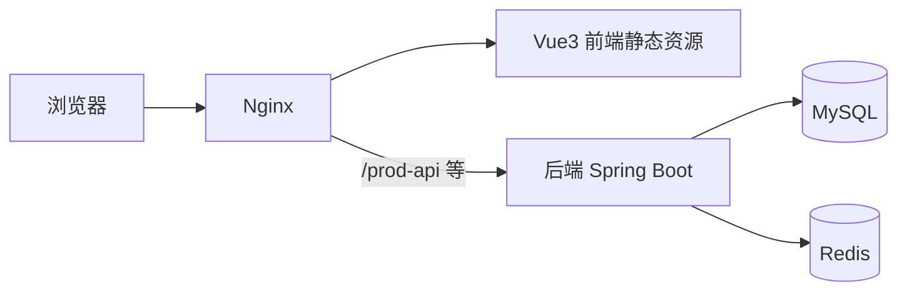

# 架构与依赖说明

## 总体架构

## 后端（若依）

- **Spring Boot**：应用容器与自动配置。
- **Spring Security**：认证授权、菜单与按钮级权限（若依封装）。
- **MyBatis / MyBatis-Plus**：持久层；若依经典版多为 MyBatis + XML，部分团队会引入 MyBatis-Plus 简化 CRUD。
- **Swagger / Knife4j**：接口文档与联调；具体访问路径以所用若依版本为准。

## 数据存储

- **MySQL**：业务数据、系统表（用户、角色、菜单、部门等）。
- **Redis**：缓存、字典、在线用户、验证码等（以实际 `application.yml` 配置为准）。

## 前端（Vue3 + Element Plus）

- **Vue Router**：路由与动态路由（若依根据权限加载）。
- **Pinia**：状态管理。
- **Axios**：请求封装、拦截器（Token、错误码）。
- **Element Plus**：表格、表单、树、对话框等，与若依生成代码风格一致。

## 环境建议

| 组件 | 建议版本（示例） |
|------|------------------|
| JDK | 17（以若依官方要求为准） |
| MySQL | 8.0+ |
| Redis | 6.x / 7.x |
| Node | 18 LTS 或 20 LTS |

## 与「中州」业务扩展

在若依代码生成器或手工模块中，按包名规范增加业务模块（如 `com.zhongzhou.xxx`），保持 Controller / Service / Mapper 分层，权限注解与若依保持一致，便于菜单与按钮授权。
